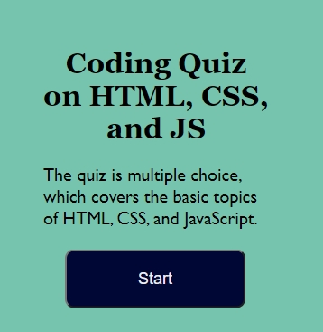
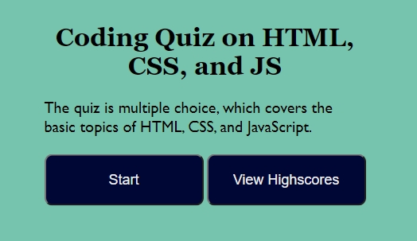
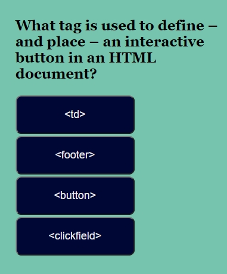
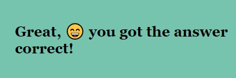
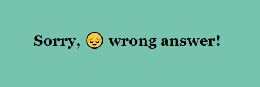
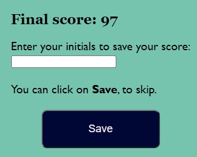
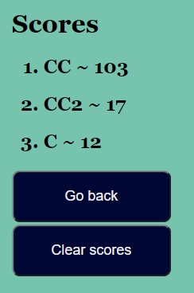

# Coding Quiz

## Description
The site quizzes the users on programming topics.

## Screenshots
Main screen with start button only  

Main screen with start and view highscores button  

Question sample  

Correct answer notification  

Wrong answer notification  

Final score, add initials and save score  

Scores list  

## Link
https://crisc3.github.io/CodingQuiz/